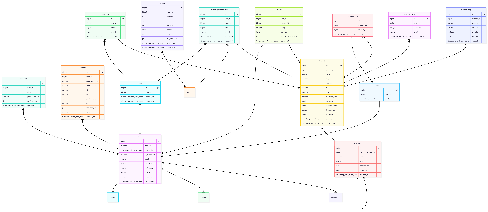

# DRF Commerce Engine

A production-ready E-Commerce backend API built with Python, Django, and Django REST Framework. This project is designed for scalability and performance, featuring a robust architecture for managing products, orders, payments, and users.


> [!IMPORTANT]
> **Presenting my DRF E-Commerce Engine**
> Please keep in mind that a non-admin user is only allowed to **READ** (i.e., GET Requests only).
> To enable Write/Update/Patch operations, you must claim the admin account by sending a **POST** request to `/api/accounts/admin-setup/` with a secret token.
>
> *Note: I will not be sharing the secret token for this specific Render deployment. To test full administrative privileges, please deploy the project yourself and configure your own token in the `.env` file.*


## 🚀 Features

-   **Authentication & Security**:
    -   JWT-based authentication (Access & Refresh tokens).
    -   Secure password handling and email verification.
    -   Role-based access control (Admin, Staff, Customer).
-   **Product Management**:
    -   Hierarchical categories.
    -   Advanced filtering, searching, and sorting.
    -   Inventory tracking with reservation system to prevent overselling.
-   **Shopping Experience**:
    -   Persistent shopping cart.
    -   Wishlist functionality.
    -   Product reviews and ratings.
-   **Order Processing**:
    -   Complex order lifecycle management.
    -   Address management for shipping/billing.
-   **Payments**:
    -   Integrated with **Chapa** payment gateway.
    -   Secure webhook handling for payment verification.
-   **Performance**:
    -   Redis validation for caching and session storage.
    -   Celery for asynchronous tasks (e.g., clearing expired cart reservations).
    -   Optimized database queries (N+1 problem prevention).
-   **Documentation**:
    -   Auto-generated Interactive API docs (Swagger & ReDoc).

## 🛠 Tech Stack

-   **Backend**: Django 5, Django REST Framework
-   **Database**: PostgreSQL
-   **Caching & Broker**: Redis
-   **Async Tasks**: Celery, Celery Beat
-   **WSGI Server**: Gunicorn
-   **Documentation**: drf-spectacular (OpenAPI 3.0)
-   **Deployment**: Render (configurations included)

## ⚙️ Prerequisites

Before you begin, ensure you have the following installed:
-   [Python 3.10+](https://www.python.org/)
-   [PostgreSQL](https://www.postgresql.org/)
-   [Redis](https://redis.io/) (Required for Celery tasks)

## 📥 Local Setup Guide

### 1. Clone User & Environment

```bash
git clone <repository-url>
cd drf-commerce-engine

# Create Virtual Environment
python -m venv venv

# Activate (Windows)
.\venv\Scripts\activate

# Activate (Linux/Mac)
source venv/bin/activate
```

### 2. Install Dependencies

```bash
pip install -r requirements.txt
```

### 3. Environment Configuration

Create a `.env` file in the root directory. You can use `.env.example` as a template.

```env
# Security
SECRET_KEY=your-super-secret-key
DEBUG=True
ALLOWED_HOSTS=localhost,127.0.0.1

# Database
POSTGRES_DB=commerce_db
POSTGRES_USER=postgres
POSTGRES_PASSWORD=your_db_password
POSTGRES_HOST=localhost
POSTGRES_PORT=5432

# Redis
CELERY_BROKER_URL=redis://localhost:6379/1
REDIS_URL=redis://localhost:6379/2

# Payments (Chapa)
CHAPA_SECRET_KEY=your-chapa-secret-key
CHAPA_WEBHOOK_SECRET=your-webhook-secret
```

### 4. Database Setup

```bash
# Apply migrations
python manage.py migrate

# Create Superuser (Admin)
python manage.py createsuperuser

# (Optional) Seed Database with Dummy Data
python scripts/verify_seed.py
```

### 5. Running the Application

**Start Django Server:**
```bash
python manage.py runserver
```

**Start Celery Worker (for background tasks):**
```bash
# Windows
celery -A config worker -l info --pool=solo

# Linux/Mac
celery -A config worker -l info
```

**Start Celery Beat (for scheduled tasks):**
```bash
celery -A config beat -l info
```

## 🚀 Deployment on Render

This project is pre-configured for deployment on [Render](https://render.com/).

### 1. Configuration
-   **Build Command:** `bash scripts/build.sh`
-   **Start Command:** `bash scripts/start.sh`

### 2. Environment Variables
Add the variables from your `.env` file to the Render dashboard.
**Important:** Set `PYTHON_VERSION` to `3.11.6` (or your local version).

### 3. Seeding the Database (Crucial Step!)
Render's free tier does not allow shell access (SSH) to run commands manually. To seed your database initially:

1.  Open `scripts/build.sh` locally.
2.  **Uncomment** the line: `python manage.py seed_db --flush`.
3.  Commit and push: `git commit -am "Enable seeding for initial deploy" && git push`.
4.  Wait for the deployment to finish. The database will be seeded during the build process.
5.  **Re-comment** the line in `scripts/build.sh`.
6.  Commit and push again: `git commit -am "Disable seeding after initial deploy" && git push`.

> **Warning:** Leaving the seeding command uncommented will reset your database on every deployment!

## 🧩 System Architecture

### Modular Design
The project follows a domain-driven design approach within Django's app structure:

-   **`apps/accounts`**: Handles user identity, profiles, and address management.
-   **`apps/products`**: Manages the catalog (Categories, Products, Images).
-   **`apps/orders`**: Orchestrates the checkout flow (Cart -> Order).
-   **`apps/payments`**: Integrates with Chapa for payment processing.
-   **`apps/inventory`**: Controls stock levels and reservations.
-   **`apps/core`**: Contains base classes, utilities, and shared permissions.

### Database Schema (ERD)

The database is designed to handle complex e-commerce relationships efficiently.



> **Note:** You can view the [Mermaid source code](docs/ERD.md) or visualize it using [Mermaid Live Editor](https://mermaid.live/).

### API Documentation
Once the server is running, the API documentation is available at:

-   **Swagger UI:** `/api/schema/swagger-ui/`
-   **ReDoc:** `/api/schema/redoc/`

---

## 🔬 Deep Technical Analysis

### 1. Configuration & Settings
The project uses `django-environ` for 12-factor app compliance.
-   **`config/settings/base.py`**: Common settings (Apps, Middleware, DRF config).
-   **`config/settings/development.py`**: Enables `DEBUG=True`, allows all hosts, and uses console email backend.
-   **`config/settings/production.py`**: Enforces HTTPS, strict CORS/CSRF, uses Whitenoise for static files, and configuring Redis/Celery for production.

### 2. Event-Driven Architecture (Signals)
We use Django Signals to decouple components and automate workflows:
-   **User Onboarding**: `post_save` on `User` automatically triggers the creation of a `UserProfile`, `Cart`, and `Wishlist`.
-   **Inventory Management**: Adding an item to the `Cart` triggers a `post_save` signal that creates an `InventoryReservation`. This temporarily holds stock (default 15 mins) to prevent overselling.
-   **Slug Generation**: Pre-save signals on `Product` and `Category` ensure URL-friendly, unique slugs (e.g., `gaming-laptop-1` if `gaming-laptop` exists).

### 3. Data Seeding & Factories
We use **Factory Boy** and **Faker** to generate realistic test data.
-   **Factories**: Defined in `apps/*/factories.py`, these classes model complex relationships (e.g., an `OrderFactory` creates a `User`, `Address`, and `OrderItems` automatically).
-   **`seed_db` Command**: A custom management command (`apps/core/management/commands/seed_db.py`) that orchestrates the seeding process:
    1.  **Flush**: Optionally wipes the database.
    2.  **Users**: Creates admin and standard users.
    3.  **Catalog**: Creates Categories and Products with realistic names/prices.
    4.  **Sales**: Generates Orders, Reviews, and active Carts for random users.

### 4. Permissions & Security
Security is enforced at the ViewSet level using custom permission classes:
-   **`IsEmailVerified`**: Restricts sensitive actions (like checkout) to users with verified emails.
-   **`IsAdminOrReadOnly`**: Allows public read access to Products but restricts editing to Admins.
-   **`IsAdminOrOwner`**: Ensures users can only view/manage their own Orders.
-   **RBAC**: The system distinguishes between `Superusers` (Admins) and standard `Customers`.

### 5. App-by-App Implementation Details

#### 👤 Accounts (`apps/accounts`)
-   **Views**: `AddressViewSet` (CRUD for shipping addresses), `SecureAdminSetupView` (secure endpoint to claim the admin account).
-   **Key Logic**: Address management automatically handles "default" address toggling.

#### 📦 Products (`apps/products`)
-   **Views**: `ProductViewSet` implements advanced filtering (Category, Price Range, Featured status) and search (Name, Description, SKU).
-   **Scaling**: Uses `select_related` and `prefetch_related` to avoid N+1 query performance issues.

#### 🛒 Orders & Cart (`apps/orders`, `apps/cart`)
-   **Cart**: `CartViewSet` manages the user's persistent cart. `CartItemViewSet` handles individual line items.
-   **Orders**: `OrderViewSet` handles order creation (converting Cart -> Order) and cancellation.
-   **Services**: `create_order_from_cart` function encapsulates the complex logic of moving items, validating stock, and locking prices.

#### 💳 Payments (`apps/payments`)
-   **Integration**: **Chapa** Payment Gateway.
-   **Flow**:
    1.  `initiate`: Creates a local `Payment` record and calls Chapa API.
    2.  `verify`: Checks payment status with Chapa and updates the Order.
    3.  `webhook`: Listens for asynchronous payment confirmation from Chapa to finalize orders even if the user closes the browser.

#### 📦 Inventory (`apps/inventory`)
-   **Concurrency**: Uses database transactions and row locking ensures stock integrity.
-   **Reservations**: The `InventoryReservation` model tracks "held" items. A Celery background task (`clear_expired_reservations`) releases stock back to the pool if checkout isn't completed in time.
