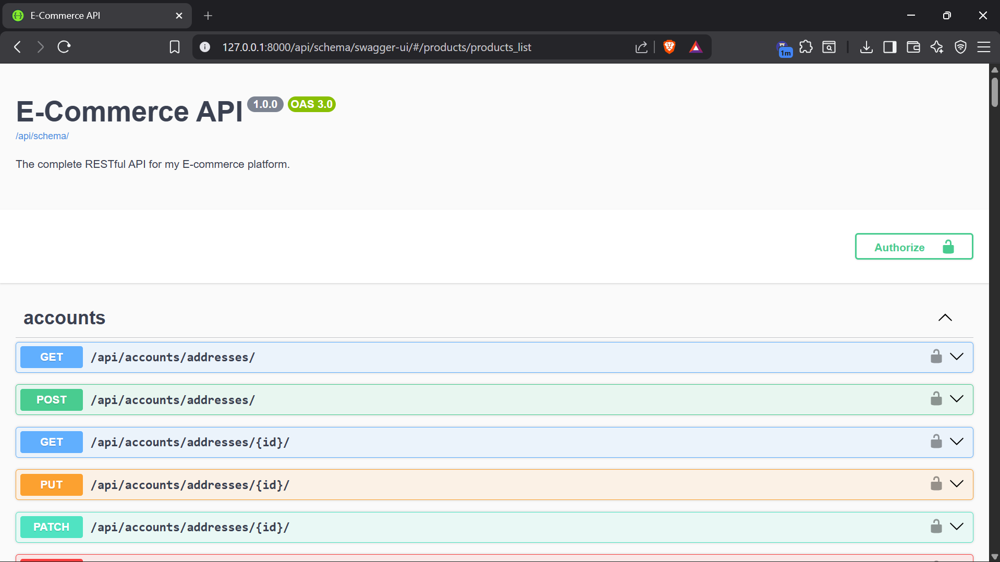

# DRF Commerce Engine

A production-ready E-Commerce backend API built with Python, Django, and Django REST Framework. This project is designed for scalability and performance, featuring a robust architecture for managing products, orders, payments, and users.



## 🚀 Features

-   **Authentication & Security**:
    -   JWT-based authentication (Access & Refresh tokens).
    -   Secure password handling and email verification.
    -   Role-based access control (Admin, Staff, Customer).
-   **Product Management**:
    -   Hierarchical categories.
    -   Advanced filtering, searching, and sorting.
    -   Inventory tracking with reservation system to prevent overselling.
-   **Shopping Experience**:
    -   Persistent shopping cart.
    -   Wishlist functionality.
    -   Product reviews and ratings.
-   **Order Processing**:
    -   Complex order lifecycle management.
    -   Address management for shipping/billing.
-   **Payments**:
    -   Integrated with **Chapa** payment gateway.
    -   Secure webhook handling for payment verification.
-   **Performance**:
    -   Redis validation for caching and session storage.
    -   Celery for asynchronous tasks (e.g., clearing expired cart reservations).
    -   Optimized database queries (N+1 problem prevention).
-   **Documentation**:
    -   Auto-generated Interactive API docs (Swagger & ReDoc).

## 🛠 Tech Stack

-   **Backend**: Django 5, Django REST Framework
-   **Database**: PostgreSQL
-   **Caching & Broker**: Redis
-   **Async Tasks**: Celery, Celery Beat
-   **WSGI Server**: Gunicorn
-   **Documentation**: drf-spectacular (OpenAPI 3.0)
-   **Deployment**: Render (configurations included)

## ⚙️ Prerequisites

Before you begin, ensure you have the following installed:
-   [Python 3.10+](https://www.python.org/)
-   [PostgreSQL](https://www.postgresql.org/)
-   [Redis](https://redis.io/) (Required for Celery tasks)

## 📥 Local Setup Guide

### 1. Clone User & Environment

```bash
git clone <repository-url>
cd drf-commerce-engine

# Create Virtual Environment
python -m venv venv

# Activate (Windows)
.\venv\Scripts\activate

# Activate (Linux/Mac)
source venv/bin/activate
```

### 2. Install Dependencies

```bash
pip install -r requirements.txt
```

### 3. Environment Configuration

Create a `.env` file in the root directory. You can use `.env.example` as a template.

```env
# Security
SECRET_KEY=your-super-secret-key
DEBUG=True
ALLOWED_HOSTS=localhost,127.0.0.1

# Database
POSTGRES_DB=commerce_db
POSTGRES_USER=postgres
POSTGRES_PASSWORD=your_db_password
POSTGRES_HOST=localhost
POSTGRES_PORT=5432

# Redis
CELERY_BROKER_URL=redis://localhost:6379/1
REDIS_URL=redis://localhost:6379/2

# Payments (Chapa)
CHAPA_SECRET_KEY=your-chapa-secret-key
CHAPA_WEBHOOK_SECRET=your-webhook-secret
```

### 4. Database Setup

```bash
# Apply migrations
python manage.py migrate

# Create Superuser (Admin)
python manage.py createsuperuser

# (Optional) Seed Database with Dummy Data
python manage.py seed_db --flush
```

### 5. Running the Application

**Start Django Server:**
```bash
python manage.py runserver
```

**Start Celery Worker (for background tasks):**
```bash
# Windows
celery -A config worker -l info --pool=solo

# Linux/Mac
celery -A config worker -l info
```

**Start Celery Beat (for scheduled tasks):**
```bash
celery -A config beat -l info
```

## 🚀 Deployment on Render

This project is pre-configured for deployment on [Render](https://render.com/).

### 1. Configuration
-   **Build Command:** `bash build.sh`
-   **Start Command:** `bash start.sh`

### 2. Environment Variables
Add the variables from your `.env` file to the Render dashboard.
**Important:** Set `PYTHON_VERSION` to `3.11.6` (or your local version).

### 3. Seeding the Database (Crucial Step!)
Render's free tier does not allow shell access (SSH) to run commands manually. To seed your database initially:

1.  Open `build.sh` locally.
2.  **Uncomment** the line: `python manage.py seed_db --flush`.
3.  Commit and push: `git commit -am "Enable seeding for initial deploy" && git push`.
4.  Wait for the deployment to finish. The database will be seeded during the build process.
5.  **Re-comment** the line in `build.sh`.
6.  Commit and push again: `git commit -am "Disable seeding after initial deploy" && git push`.

> **Warning:** Leaving the seeding command uncommented will reset your database on every deployment!

## 🧩 Technical Breakdown

### Architecture
The project follows a standard Django app structure, ensuring modularity and maintainability.

-   **`apps/accounts`**: Custom User model, Profiles, Addresses.
-   **`apps/products`**: Categories, Products, Images, Reviews.
-   **`apps/orders`**: Carts, Orders, Order Items.
-   **`apps/payments`**: Payment processing logic (Chapa integration).
-   **`apps/core`**: Shared utilities, base models, management commands.

### Database Schema (ERD)

The database is designed to handle complex e-commerce relationships efficiently.


> **Note:** You can view the [Mermaid source code](my_erd.md) or visualize it using [Mermaid Live Editor](https://mermaid.live/).

### API Documentation
Once the server is running, the API documentation is available at:

-   **Swagger UI:** `/api/schema/swagger-ui/`
-   **ReDoc:** `/api/schema/redoc/`
